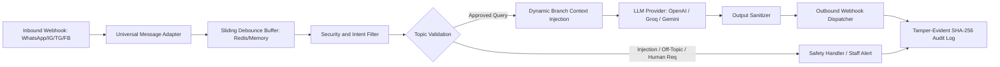

# omnichannel-ai-gateway

Multi-tenant conversational gateway and management system for multi-branch hospitality messaging channels.

## Overview

Omnichannel Branch Assistant is a multi-tenant messaging gateway that integrates WhatsApp Cloud API, Instagram DM, Facebook Messenger, and Telegram into a unified backend. It normalizes incoming webhooks across 17 distinct facility branches, buffers fragmented customer messages using a sliding debounce queue, filters input through an intent and prompt-injection security layer, and generates contextual responses via pluggable LLM providers while synchronizing state to a real-time management dashboard.

## Architecture and Pipeline

The application processes messages through a linear gateway, validation, debounce, and routing pipeline.



- Inbound Ingestion: Normalized webhook endpoints receive JSON payloads, verify platform signatures (e.g., Meta challenge tokens), and map requests into a canonical `UniversalMessage` schema.
- Debounce Queue: Rapid successive turns from the same user session are held for a configurable window (default 15 seconds) using Redis or an in-memory sliding buffer, aggregating partial messages into a single prompt.
- Security and Threat Defense: Input is checked against regex-based prompt injection patterns, out-of-scope abuse rules, and keyword allowlists before dispatching to model endpoints. Requests requiring staff intervention trigger web push notifications (`ntfy.sh`) and automatically pause AI processing for that session.
- Context Assembly: System prompts are constructed at runtime with branch-specific operating hours, treatment catalogs, pricing matrices, and transport logistics.
- Generation and Output Sanitization: Selected LLM providers generate responses which are parsed for code blocks, formatting anomalies, and sensitive data leakage before external transmission.
- Audit Logging: All inbound messages, security triggers, and outbound responses are hashed and appended to a tamper-evident audit log (`bot_audit.log`).

## Tech Stack

| Layer | Component | Description |
| :--- | :--- | :--- |
| Backend Runtime | Python 3.10+ | Core application runtime |
| Web Framework | FastAPI, Uvicorn | Asynchronous REST and Webhook gateway |
| Database Engine | SQLite (default) / PostgreSQL | Relational storage for tenants, conversations, and staff accounts |
| Caching & Buffering | Redis (optional) / In-Memory Queue | Debounce message aggregation and session management |
| Authentication | PyJWT, Passlib (bcrypt) | Role-based access control for dashboard operators |
| Integrations | HTTPX | Upstream model APIs and social platform dispatchers |
| Frontend | HTML5, Vanilla JavaScript, CSS3 | Live dashboard, conversation inspector, and branch editor |

## Project Structure

```text
omnichannel-branch-assistant/
├── .env.example              # Sample environment configuration
├── .gitignore                # Source control ignore specifications
├── README.md                 # Technical documentation
├── docker-compose.yml        # Multi-container orchestration (app, db, redis)
├── requirements.txt          # Root Python dependency manifest
├── backend/                  # Application core
│   ├── main.py               # FastAPI entrypoint and webhook routes
│   ├── config.py             # Typed settings from environment variables
│   ├── database.py           # SQLite / PostgreSQL schema and queries
│   ├── security.py           # Authentication, JWT, and input filtering
│   ├── notifier.py           # Push notification dispatcher (ntfy)
│   ├── requirements.txt      # Backend Python package manifest
│   └── tests/                # Pytest automated test suites
├── bridge/                   # Node.js connector service (optional WhatsApp web client)
│   ├── package.json          # Node dependency manifest
│   └── index.js              # Bridge gateway
├── frontend/                 # Operator dashboard assets
│   ├── index.html            # Web management console
│   └── app.js                # Live polling and administration logic
├── deployment/               # Systemd units, Nginx configs, and deploy scripts
└── scripts/                  # Seed, synchronization, and diagnostic utilities
```

## Setup and Prerequisites

### Prerequisites
- Python 3.10 or higher
- Node.js 18+ (only if running the optional bridge service)
- Redis 6+ (recommended for multi-process deployments; falls back to in-memory)

### Local Environment Setup

1. Clone or navigate to the repository:
   ```bash
   cd c:/Tools/omnichannel-branch-assistant
   ```

2. Create and activate a virtual environment:
   ```bash
   python -m venv .venv
   .venv\Scripts\activate
   ```

3. Install backend dependencies:
   ```bash
   pip install -r requirements.txt
   ```

4. Create configuration file:
   ```bash
   copy .env.example .env
   ```

5. Populate `.env` with model keys and admin credentials:
   ```ini
   LLM_PROVIDER=openai
   LLM_API_KEY=your_openai_api_key_here
   LLM_MODEL=gpt-4o-mini
   JWT_SECRET_KEY=generate_a_random_32_byte_hex_string
   ```

## Usage Examples

### Starting the Backend Gateway
```bash
python -m uvicorn backend.main:app --host 0.0.0.0 --port 8000 --reload
```
The dashboard interface will be served at `http://127.0.0.1:8000/`.

### Running Verification Tests
Execute the unit and security test suites:
```bash
pytest backend/tests/
```

### Manual Webhook Simulation
Simulate an incoming message from a WhatsApp user to verify routing:
```bash
curl -X POST http://127.0.0.1:8000/api/webhook/test \
  -H "Content-Type: application/json" \
  -d '{
    "channel": "whatsapp",
    "branch_id": "istanbul-airport",
    "customer_id": "905551234567",
    "text": "What are your massage prices today?"
  }'
```

### Primary Environment Variables

| Variable | Default Value | Description |
| :--- | :--- | :--- |
| `HOST` | `0.0.0.0` | Binding interface for HTTP server |
| `PORT` | `8000` | Binding port for HTTP server |
| `DATABASE_PATH` | `backend/omnichannel_data.db` | Local SQLite database file location |
| `DATABASE_URL` | None | Optional PostgreSQL connection string |
| `REDIS_URL` | `redis://localhost:6379/0` | Connection string for Redis cache |
| `DEBOUNCE_SECONDS` | `15` | Window duration for aggregating incoming turns |
| `LLM_PROVIDER` | `openai` | Model provider: `openai`, `groq`, `gemini`, `ollama` |
| `LLM_API_KEY` | None | API authentication key for upstream LLM provider |
| `LLM_MODEL` | `gpt-4o-mini` | Model identifier string |

## Notes and Constraints

- Debounce Latency: The sliding buffer introduces up to `DEBOUNCE_SECONDS` latency before triggering an LLM completion to accommodate conversational multi-message inputs.
- Rate Limiting: Operator login attempts are locked after 5 consecutive failures for a 15-minute window per IP to defend against credential stuffing.
- Logging Integrity: `bot_audit.log` uses sequential cryptographic hashing. Altering historical log entries invalidates subsequent hash checksums.
